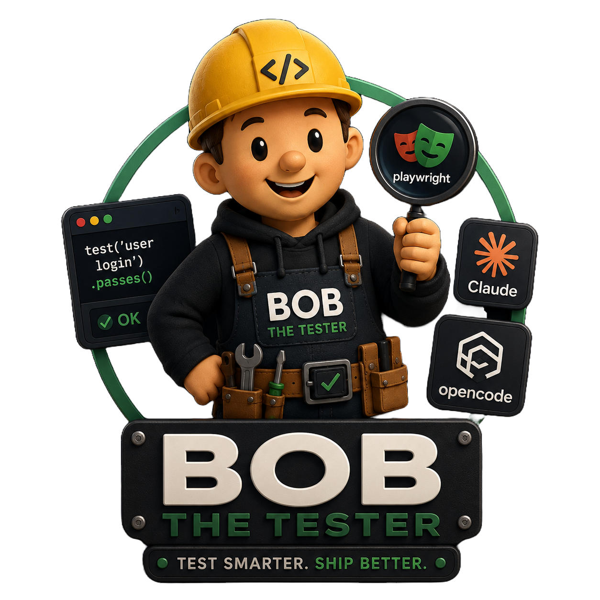
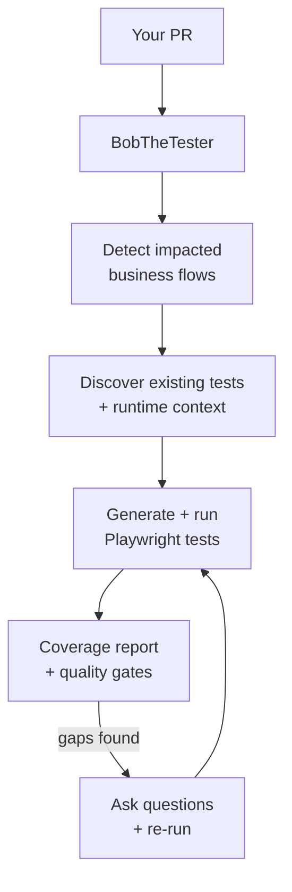
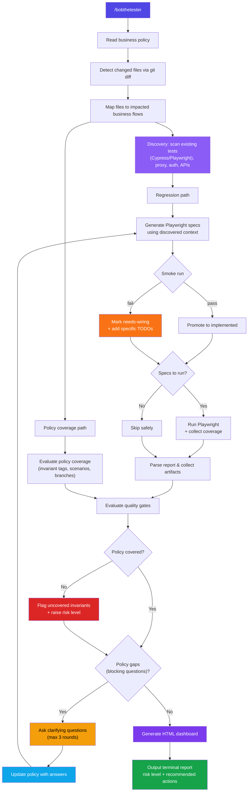

<p align="center">
  
</p>

# BobTheTester

Automated regression review and policy coverage analysis for PRs, powered by MCP tools and Playwright.

Give it your business policy, it analyzes your PR, generates missing Playwright tests, runs them, and tells you what's covered and what's not.

## How it works



## Quick start

```bash
git clone <REPO-URL> && cd BobTheTester
./scripts/setup-bobthetester.sh --write-desktop-config --install-command /path/to/your/project
```

Then open your project in Claude or OpenCode and run:

```
/bobthetester config/regression/business-review-policy.json
```

The setup script installs the MCP server and copies the `/bobthetester` command into your project. You need both for it to work.

## Input formats

The command accepts anything:

```text
/bobthetester                                          # uses default policy
/bobthetester config/regression/business-review-policy.json   # JSON policy file
/bobthetester docs/requirements.pdf                    # PDF, Markdown, any format
/bobthetester The registration flow must validate email and persist the user...  # free text
```

Non-JSON input is automatically converted to a structured policy before running.

## MCP setup

### Claude Desktop

```bash
./scripts/setup-bobthetester.sh --write-desktop-config
```

Or manually in your Claude MCP config:

```json
{
  "mcpServers": {
    "bobthetester": {
      "command": "node",
      "args": ["/absolute/path/to/BobTheTester/tools/regression-mcp/dist/index.js"]
    }
  }
}
```

### OpenCode

```bash
./scripts/setup-bobthetester.sh --write-opencode-config
```

Or manually in `opencode.jsonc`:

```jsonc
{
  "mcp": {
    "bobthetester": {
      "type": "local",
      "command": ["node", "/absolute/path/to/BobTheTester/tools/regression-mcp/dist/index.js"],
      "enabled": true
    }
  }
}
```

The same command file is shared via symlink — works identically in both clients.

## What it produces

- **Terminal report**: summary, policy coverage per flow, test results, quality gates, recommended actions
- **HTML dashboard** (`artifacts/report.html`): interactive treemap + radar charts with D3.js
- **Generated Playwright specs**: tests for uncovered business flows with honest status tracking
- **JSON output** (`artifacts/unified-review-output.json`): full machine-readable results

### Test status lifecycle

| Status | Meaning | Gate credit |
|--------|---------|:-----------:|
| `scaffold` | Placeholder body, no real assertions | 0% |
| `needs-wiring` | Real structure but unresolved integration points (TODO comments, unverified auth) | 0% |
| `implemented` | Verified green in a real Playwright run | 100% |

`implemented` is **never assigned automatically** — only after a verified green run. Tests with `TODO` comments are marked `needs-wiring`, not `implemented`.

### Quality gates

| Gate | Passes when |
|------|-------------|
| Suite completeness | All impacted flows have implemented tests (no scaffold or needs-wiring) |
| Policy coverage | Coverage score >= 70% |
| Regression risk | Risk level is `low` or `medium` |

### Policy coverage scoring

| Dimension | Weight | What it measures |
|-----------|--------|-----------------|
| Regression scenarios | 50% | Implemented vs required test scenarios |
| Must-hold invariants | 30% | Business invariants covered by tests (matched via `[invariant-id:xxx]` tags or keyword fallback) |
| Branch coverage | 20% | V8 branch coverage from Playwright |

## CLI usage (without Claude)

```bash
npm run build
npm run unified-review -- '{"baseRef":"origin/main","dryRun":false}'
npm run suite           # generate specs from policy
npm run suite:check     # validate completeness
```

## Configuration

| File | Purpose |
|------|---------|
| `config/regression/business-review-policy.json` | Business flows, invariants, required coverage |
| `config/regression/flow-map.json` | Source file patterns → business flow mapping |
| `config/regression/flow-spec-map.json` | Business flow → Playwright spec mapping |
| `config/regression/tooling.json` | Git refs, Playwright config, report paths |

## In-depth overview



## Sandbox

Try BobTheTester on a real app: **[Sandbox-BobTheTester](https://github.com/AlbertoSardo/Sandbox-BobTheTester)** — a clinic management app with 3 business flows and step-by-step test scenarios.

## Docs

- [Quick start](docs/ai/bobthetester-quickstart.md)
- [Usage guide](docs/ai/regression-mcp-usage.md)
- [Architecture](docs/ai/regression-mcp-plan.md)
- [Status](docs/ai/regression-mcp-status.md)
