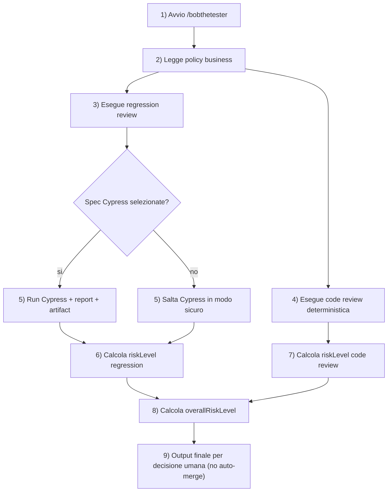

# BobTheTester

Workflow MCP deterministico per fare regression review su flow di business con Cypress, integrato in Claude tramite comando `/bobthetester`.

## Cosa fa
- Mappa i file cambiati su flow di business (`onboarding`, `offboarding`, `profile`, `permissions`)
- Seleziona in modo deterministico le spec Cypress rilevanti
- Esegue regression test con output machine-readable
- Raccoglie report e artifact
- Evidenzia gap di copertura (flow senza spec o file non mappati)
- Esegue code review deterministica con finding strutturati per severita
- Produce un output finale strutturato con rischio (`low` -> `critical`)

## Principi del progetto
- Tool MCP deterministici, senza ragionamento nascosto nel layer tool
- Logica di business esplicita in JSON versionato
- Orchestrazione agentica separata dal layer di esecuzione
- Cypress come execution engine per regression UI

## Prerequisiti
- Node.js e npm disponibili in PATH
- Git
- GitHub CLI (`gh`) opzionale, utile per operazioni repo/PR
- Claude con supporto MCP e comandi repository (per usare `/bobthetester`)

## Installazione rapida (da GitHub)
Dal root del repo:

```bash
git clone <URL-REPO>
cd BobTheTester
./scripts/setup-bobthetester.sh
```

Questo script:
1. installa dipendenze in `tools/regression-mcp`
2. builda il server MCP
3. genera snippet config MCP locale in:
   - `~/.config/tiware/bobthetester/claude-mcp-server.local.json`

Per fare anche merge automatico nella config di Claude Desktop:

```bash
./scripts/setup-bobthetester.sh --write-desktop-config
```

Opzioni utili:
- `--skip-install`
- `--skip-build`
- `--desktop-config-path <path>`

## Configurazione MCP in Claude (manuale)
Se non usi il merge automatico, aggiungi server MCP nella tua config Claude.

Template di riferimento: `config/regression/claude-mcp-server.example.json`

Esempio:

```json
{
  "mcpServers": {
    "tiware-regression": {
      "command": "node",
      "args": [
        "/ABSOLUTE/PATH/TO/BobTheTester/tools/regression-mcp/dist/index.js"
      ]
    }
  }
}
```

## Uso consigliato: `/bobthetester`
Il comando custom e in `.claude/commands/bobthetester.md`.

Esempi:

```text
/bobthetester
/bobthetester {"changedFiles":["src/features/user-onboarding/step.ts"],"dryRun":false,"browser":"electron"}
```

Comportamento atteso:
1. legge policy business (`read_business_review_policy`)
2. esegue review orchestrata (`generate_regression_review`) che include:
   - mapping file -> flow,
   - generazione/aggiornamento suite sui flow impattati,
   - validazione completezza,
   - run Cypress locale sulle sole spec selezionate,
   - output finale comprensivo con rischio e azioni.
3. esegue anche `generate_code_review_report` sullo stesso scope di modifica.
4. se non ci sono spec impattate, salta Cypress (no full suite implicita) e riporta gap/risk.
5. produce un risultato unico che combina regression + code-review.
6. non esegue auto-merge: fornisce evidenze e rischio per supportare la decisione umana di merge.

## Flusso end-to-end (come funziona)



Spiegazione semplice degli step:
1. Avvii `/bobthetester` con file cambiati o con `baseRef/headRef`.
2. L'agente carica la policy business per sapere cosa controllare.
3. Parte il flusso regression: mapping flow, suite/check, selezione spec.
4. In parallelo parte la code review deterministica sullo stesso scope.
5. Se ci sono spec, esegue Cypress; se non ci sono, lo salta senza full suite implicita.
6. Calcola il rischio regression dai risultati test/copertura.
7. Calcola il rischio code review dai finding deterministici.
8. Combina i due rischi in `overallRiskLevel`.
9. Restituisce un report unico per aiutare la decisione umana di merge.

## Esecuzione manuale (senza slash command)
Dal root del repo:

```bash
npm --prefix tools/regression-mcp install
npm --prefix tools/regression-mcp run build
```

1) Genera o aggiorna suite da policy:

```bash
npm --prefix tools/regression-mcp run suite -- '{}'
```

2) Valida copertura suite:

```bash
npm --prefix tools/regression-mcp run suite:check -- '{}'
```

3) Esegui review completa su changed files espliciti:

```bash
npm --prefix tools/regression-mcp run review -- '{"changedFiles":["src/features/user-onboarding/step.ts"],"dryRun":false,"browser":"electron"}'
```

4) Oppure modalita git-diff driven:

```bash
npm --prefix tools/regression-mcp run review -- '{"baseRef":"origin/main","headRef":"HEAD","includeUntracked":true,"dryRun":false}'
```

5) (Opzionale) solo gate code review via CLI:

```bash
npm --prefix tools/regression-mcp run code-review -- '{"baseRef":"origin/main","headRef":"HEAD","includeUntracked":false}'
```

## Tool MCP disponibili
- `get_changed_files`
- `map_impacted_flows`
- `list_relevant_cypress_specs`
- `generate_cypress_suite`
- `validate_cypress_suite`
- `run_cypress`
- `read_cypress_report`
- `collect_artifacts`
- `suggest_missing_tests`
- `read_business_review_policy`
- `generate_code_review_report`
- `generate_regression_review`

## Config principali da conoscere
- `config/regression/flow-map.json` -> changed files -> flow
- `config/regression/flow-spec-map.json` -> flow -> spec Cypress
- `config/regression/business-review-policy.json` -> criteri business e copertura minima
- `config/regression/tooling.json` -> configurazione esecuzione/report/artifact
- `config/regression/review-output.schema.json` -> schema output finale
- `config/regression/code-review-policy.json` -> regole deterministiche code review
- `config/regression/code-review-output.schema.json` -> schema output code review

Mappa leggibile per reviewer:
- `docs/flows/test-mapping.json`

## Output e artifact
- Report JSON Cypress: `artifacts/cypress/results.json`
- Video: `cypress/videos/`
- Screenshot: `cypress/screenshots/`

L'output review include almeno:
- `mapping`
- `impactedFlows`
- `suiteGeneration`
- `suiteCompleteness`
- `selectedSpecs`
- `passFailSummary`
- `failedTests`
- `artifactPaths`
- `suggestedMissingTests`
- `riskLevel`

L'output code review include almeno:
- `summary`
- `findings`
- `findingCounts`
- `riskLevel`
- `recommendedActions`

## Come mantenere il sistema aggiornato
Quando aggiungi/modifichi flow di business:
1. aggiorna `config/regression/business-review-policy.json`
2. aggiorna `config/regression/flow-map.json`
3. aggiorna `config/regression/flow-spec-map.json`
4. sincronizza `docs/flows/test-mapping.json`
5. rigenera e valida suite:

```bash
npm --prefix tools/regression-mcp run suite -- '{}'
npm --prefix tools/regression-mcp run suite:check -- '{}'
```

## Troubleshooting rapido
- `/bobthetester` non trovato: verifica che il client Claude carichi `.claude/commands/`
- MCP non parte: verifica che esista `tools/regression-mcp/dist/index.js` (build mancante)
- Nessun test eseguito: controlla `dryRun` (se `true`, esecuzione reale viene saltata)
- Nessuna spec selezionata: Cypress viene saltato per sicurezza; controlla mapping in `flow-map.json` e `flow-spec-map.json`

## Documentazione di dettaglio
- `docs/ai/bobthetester-quickstart.md`
- `docs/ai/regression-mcp-usage.md`
- `docs/ai/regression-mcp-plan.md`
- `docs/ai/regression-mcp-status.md`
