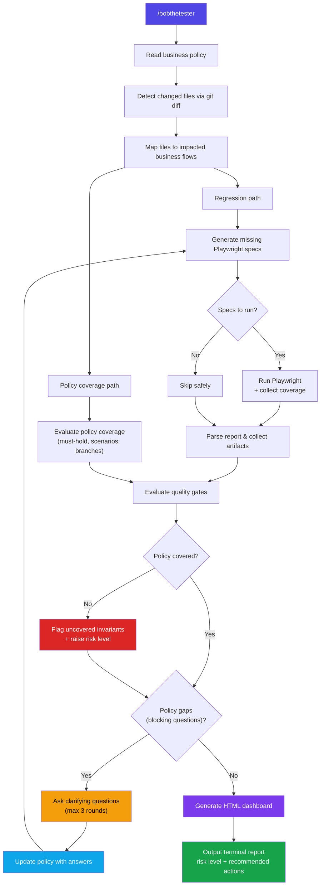

# BobTheTester

Automated regression review and policy coverage analysis for PRs, powered by deterministic MCP tools and Playwright.

BobTheTester analyzes code changes in a PR, maps them to impacted business flows, generates missing Playwright regression tests, runs them, evaluates how well the code covers business policy requirements, and produces a clear report with risk level, quality gates, and recommended actions.

## How it works



## Quick start

### Prerequisites

- Node.js >= 18 and npm
- Git
- Claude with MCP support or [OpenCode](https://opencode.ai) (for the `/bobthetester` command)

### Installation

```bash
git clone <REPO-URL>
cd BobTheTester
./scripts/setup-bobthetester.sh
```

This script installs dependencies, downloads Chromium for Playwright, builds the MCP server, and generates a local MCP config snippet.

### Setup with Claude Desktop

To automatically merge into your Claude Desktop config:

```bash
./scripts/setup-bobthetester.sh --write-desktop-config
```

Or manually add to your Claude MCP config:

```json
{
  "mcpServers": {
    "tiware-regression": {
      "command": "node",
      "args": ["/absolute/path/to/BobTheTester/tools/regression-mcp/dist/index.js"]
    }
  }
}
```

### Setup with OpenCode

To automatically merge into your project's `opencode.jsonc`:

```bash
./scripts/setup-bobthetester.sh --write-opencode-config
```

Or manually add to your `opencode.jsonc`:

```jsonc
{
  "$schema": "https://opencode.ai/config.json",
  "mcp": {
    "bobthetester": {
      "type": "local",
      "command": ["node", "/absolute/path/to/BobTheTester/tools/regression-mcp/dist/index.js"],
      "enabled": true
    }
  }
}
```

The `/bobthetester` command works identically in both clients — the same prompt file is shared via symlink between `.claude/commands/` and `.opencode/commands/`.

## Usage

### With Claude or OpenCode (`/bobthetester`)

The primary way to use BobTheTester is through the `/bobthetester` slash command in Claude or OpenCode:

```text
/bobthetester config/regression/business-review-policy.json
```

You can pass a policy file in any format, a JSON object with options, plain text from a ticket, or nothing to use defaults:

```text
/bobthetester
/bobthetester config/regression/business-review-policy.json
/bobthetester docs/requirements.pdf
/bobthetester {"baseRef": "origin/main", "dryRun": false}
/bobthetester The onboarding flow must capture required fields and activate the user account...
```

BobTheTester will:
1. Evaluate how well your code changes cover the business policy requirements
2. Generate any missing Playwright regression tests for impacted business flows
3. Run the tests and collect branch coverage data
4. Ask targeted questions if the business policy is incomplete
5. Generate an interactive HTML dashboard with D3.js visualizations
6. Output a structured terminal report with risk level and recommended actions

### From the command line (without Claude)

All commands work from the project root:

```bash
# Install and build
npm install --prefix tools/regression-mcp
npm run build

# Generate/update Playwright specs from business policy
npm run suite

# Validate suite completeness
npm run suite:check

# Run a full unified review (regression + policy coverage)
npm run unified-review -- '{"baseRef":"origin/main","headRef":"HEAD","dryRun":false}'

# Run only regression review
npm run review -- '{"baseRef":"origin/main","headRef":"HEAD","dryRun":false}'

# Run a single MCP tool directly
npm run tool -- get_changed_files '{"baseRef":"origin/main","headRef":"HEAD"}'
npm run tool -- evaluate_policy_coverage '{"baseRef":"origin/main"}'
```

## Project structure

```
BobTheTester/
  .claude/commands/
    bobthetester.md              # Claude slash command definition
  config/regression/
    business-review-policy.json  # Business flows, invariants, required coverage
    code-review-policy.json      # Legacy code review rules (still available as standalone tool)
    flow-map.json                # Changed files -> business flow mapping
    flow-spec-map.json           # Business flow -> Playwright spec mapping
    tooling.json                 # Execution config (git refs, Playwright, reports)
    *.schema.json                # Reference-only output schemas (not enforced at runtime)
  playwright/e2e/flows/
    *.spec.ts                    # Playwright regression specs (per business flow)
  tools/regression-mcp/
    src/
      index.ts                   # MCP server entry point
      server.ts                  # MCP server (stdio transport)
      cli.ts                     # CLI wrapper for local use
      review.ts                  # Regression review orchestrator
      unified-review.ts          # Unified review orchestrator (regression + policy coverage)
      tool-registry.ts           # MCP tool registration
      types.ts                   # TypeScript type definitions
      config.ts                  # Config loaders and path resolution
      tools/                     # Individual MCP tool implementations
      utils/                     # Shared utilities (git, fs, pattern matching, helpers)
  scripts/
    setup-bobthetester.sh        # One-command setup script
  docs/ai/                       # Architecture docs and status tracking
```

## Configuration

### Business review policy (`business-review-policy.json`)

Defines the business flows BobTheTester protects. Each flow specifies:

- **userGoal**: what the user is trying to accomplish
- **mustHold**: invariants that must always be true
- **minimumRegressionCoverage**: scenarios that require Playwright tests
- **conceptualReviewQuestions**: questions for human reviewers
- **executionHints**: entry paths and actor roles for test execution

Placeholder values (`<set-...>`, `TODO`, `TBD`) are detected automatically and trigger clarification questions.

### Flow mapping (`flow-map.json`)

Maps source file glob patterns to business flow IDs. When a file matching `src/onboarding/**` changes, the `user-onboarding` flow is flagged as impacted.

### Code review policy (`code-review-policy.json`) — legacy

Defines deterministic rules for the legacy code review tool (`generate_code_review_report`). This tool is still available but is no longer used by the unified review pipeline, which uses `evaluate_policy_coverage` instead.

## MCP tools

BobTheTester exposes 16 MCP tools, all deterministic:

| Tool | Purpose |
|------|---------|
| `get_changed_files` | Git diff to list changed/untracked files |
| `map_impacted_flows` | Map changed files to business flows |
| `list_relevant_playwright_specs` | Resolve flows to Playwright spec files |
| `generate_playwright_suite` | Generate/update scaffold specs from policy |
| `validate_playwright_suite` | Check spec completeness vs policy coverage |
| `run_playwright` | Execute Playwright on selected specs |
| `read_playwright_report` | Parse Playwright JSON report |
| `collect_artifacts` | Collect screenshots, videos, traces |
| `suggest_missing_tests` | Identify unmapped files and flows without specs |
| `suggest_policy_clarifications` | Surface incomplete/placeholder policy values |
| `read_business_review_policy` | Read the business policy file |
| `evaluate_policy_coverage` | Measure how well code covers policy requirements |
| `generate_code_review_report` | Run deterministic code review checks (legacy) |
| `generate_html_report` | Generate interactive HTML dashboard with D3.js |
| `generate_regression_review` | Full regression review pipeline |
| `generate_unified_review` | Combined regression + policy coverage in one call |

## Quality gates

The unified review evaluates three independent gates:

| Gate | Passes when |
|------|-------------|
| **Suite completeness** | All impacted flows have implemented (non-scaffold) Playwright tests |
| **Policy coverage** | Overall policy coverage score >= 70% |
| **Regression risk** | Regression risk is `low` or `medium` |

The combined gate passes only when all three pass. Risk levels: `low` < `medium` < `high` < `critical`.

### Scaffold-first policy

Generated tests start with `[status:scaffold]` and block quality gates until promoted to `[status:implemented]` with real Playwright assertions. To promote a test:

1. Replace the scaffold placeholder with real page interactions and assertions
2. Change `[status:scaffold]` to `[status:implemented]` in the test title
3. Re-run `npm run suite:check` to verify

### Policy coverage scoring

Each impacted flow gets a coverage score (0-100%) based on three weighted dimensions:

| Dimension | Weight | What it measures |
|-----------|--------|-----------------|
| **Regression scenarios** | 50% | How many `minimumRegressionCoverage` scenarios have `[status:implemented]` tests |
| **Must-hold invariants** | 30% | How many `mustHold` invariants are covered by implemented test titles |
| **Branch coverage** | 20% | V8 branch coverage from Playwright execution (via monocart-reporter) |

### Interactive HTML dashboard

After each run, BobTheTester generates an interactive HTML report at `artifacts/report.html` with:

- **Treemap**: coverage by flow, sized by number of scenarios, colored by score (green/yellow/red)
- **Global radar chart**: all flows compared on one spider chart
- **Per-flow radar**: click a flow to see must-hold, regression, and branch coverage on 3 axes
- **Quality gates table**, recommended actions, and warnings

Open it in any browser — no server needed.

## Development

```bash
# Type checking
npm run typecheck

# Linting (ESLint with TypeScript strict + Prettier)
npm run lint
npm run lint:fix

# Formatting
npm run format
npm run format:check

# Build
npm run build
```

## Troubleshooting

| Problem | Solution |
|---------|----------|
| `/bobthetester` not found | Verify your Claude client loads `.claude/commands/` |
| MCP server won't start | Check that `tools/regression-mcp/dist/index.js` exists (run `npm run build`) |
| No tests executed | Check `dryRun` setting (default is `false` via the slash command) |
| No specs selected | Playwright is skipped safely; check `flow-map.json` and `flow-spec-map.json` |
| Regression gate fails with green tests | Check for `[status:scaffold]` scenarios on impacted flows |
| High risk despite implemented flows | Check `clarificationQuestions` for blocking policy gaps |
| Report format not supported | Only JSON format is implemented; set `reportFormat: "json"` |
| HTML dashboard not generated | Ensure `generate_html_report` is called with unified review output; check `artifacts/report.html` |
| Branch coverage always 0% | Run Playwright tests with `dryRun: false`; monocart-reporter collects V8 coverage only during real execution |

## Sandbox

To try BobTheTester end-to-end on a real app with realistic PR scenarios, use the sandbox repo:

**[Sandbox-BobTheTester](https://github.com/AlbertoSardo/Sandbox-BobTheTester)** — A clinic management app (Express + SQLite) with 3 business flows, Playwright tests with mixed coverage, and step-by-step instructions for 4 test scenarios.

## Documentation

- [Quick start guide](docs/ai/bobthetester-quickstart.md)
- [Detailed usage guide](docs/ai/regression-mcp-usage.md)
- [Architecture plan](docs/ai/regression-mcp-plan.md)
- [Current status](docs/ai/regression-mcp-status.md)
