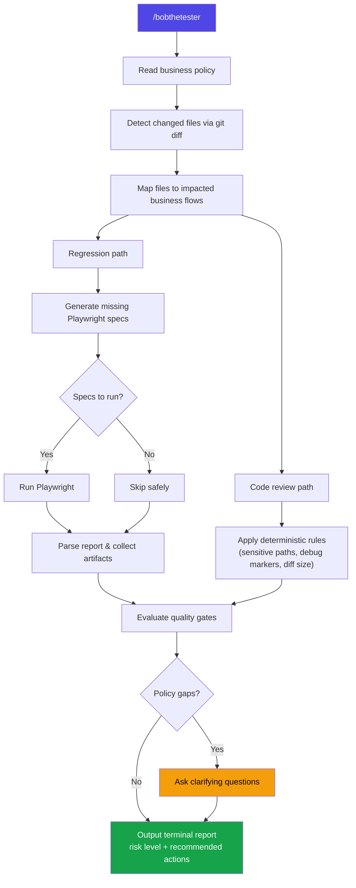

# BobTheTester

Automated regression review and code review for PRs, powered by deterministic MCP tools and Playwright.

BobTheTester analyzes code changes in a PR, maps them to impacted business flows, generates missing Playwright regression tests, runs them, performs a deterministic code review, and produces a clear report with risk level, quality gates, and recommended actions.

## How it works



## Quick start

### Prerequisites

- Node.js >= 18 and npm
- Git
- Claude with MCP support (for the `/bobthetester` command)

### Installation

```bash
git clone <REPO-URL>
cd BobTheTester
./scripts/setup-bobthetester.sh
```

This script installs dependencies, downloads Chromium for Playwright, builds the MCP server, and generates a local MCP config snippet at `~/.config/tiware/bobthetester/claude-mcp-server.local.json`.

To automatically merge into your Claude Desktop config:

```bash
./scripts/setup-bobthetester.sh --write-desktop-config
```

### Manual MCP setup

If you prefer manual configuration, add the server to your Claude MCP config:

```json
{
  "mcpServers": {
    "tiware-regression": {
      "command": "node",
      "args": ["/absolute/path/to/BobTheTester/tools/regression-mcp/dist/index.js"]
    }
  }
}
```

Template: `config/regression/claude-mcp-server.example.json`

## Usage

### With Claude (`/bobthetester`)

The primary way to use BobTheTester is through the Claude slash command:

```text
/bobthetester config/regression/business-review-policy.json
```

You can pass just the policy file path, a JSON object with options, or nothing to use defaults:

```text
/bobthetester
/bobthetester {"baseRef": "origin/main", "dryRun": false}
```

BobTheTester will:
1. Review your code changes and report findings by severity
2. Generate any missing Playwright regression tests for impacted business flows
3. Run the tests and report pass/fail results
4. Ask targeted questions if the business policy is incomplete
5. Output a structured report with risk level and recommended actions

### From the command line (without Claude)

All commands work from the project root:

```bash
# Install and build
npm install --prefix tools/regression-mcp
npm run build

# Generate/update Playwright specs from business policy
npm run suite

# Validate suite completeness
npm run suite:check

# Run a full unified review (regression + code review)
npm run unified-review -- '{"baseRef":"origin/main","headRef":"HEAD","dryRun":false}'

# Run only regression review
npm run review -- '{"baseRef":"origin/main","headRef":"HEAD","dryRun":false}'

# Run only code review
npm run code-review -- '{"baseRef":"origin/main","headRef":"HEAD"}'

# Run a single MCP tool directly
npm run tool -- get_changed_files '{"baseRef":"origin/main","headRef":"HEAD"}'
```

## Project structure

```
BobTheTester/
  .claude/commands/
    bobthetester.md              # Claude slash command definition
  config/regression/
    business-review-policy.json  # Business flows, invariants, required coverage
    code-review-policy.json      # Deterministic code review rules
    flow-map.json                # Changed files -> business flow mapping
    flow-spec-map.json           # Business flow -> Playwright spec mapping
    tooling.json                 # Execution config (git refs, Playwright, reports)
    *.schema.json                # Reference-only output schemas (not enforced at runtime)
  playwright/e2e/flows/
    *.spec.ts                    # Playwright regression specs (per business flow)
  tools/regression-mcp/
    src/
      index.ts                   # MCP server entry point
      server.ts                  # MCP server (stdio transport)
      cli.ts                     # CLI wrapper for local use
      review.ts                  # Regression review orchestrator
      unified-review.ts          # Unified review orchestrator (regression + code review)
      tool-registry.ts           # MCP tool registration
      types.ts                   # TypeScript type definitions
      config.ts                  # Config loaders and path resolution
      tools/                     # Individual MCP tool implementations
      utils/                     # Shared utilities (git, fs, pattern matching, helpers)
  scripts/
    setup-bobthetester.sh        # One-command setup script
  docs/ai/                       # Architecture docs and status tracking
```

## Configuration

### Business review policy (`business-review-policy.json`)

Defines the business flows BobTheTester protects. Each flow specifies:

- **userGoal**: what the user is trying to accomplish
- **mustHold**: invariants that must always be true
- **minimumRegressionCoverage**: scenarios that require Playwright tests
- **conceptualReviewQuestions**: questions for human reviewers
- **executionHints**: entry paths and actor roles for test execution

Placeholder values (`<set-...>`, `TODO`, `TBD`) are detected automatically and trigger clarification questions.

### Flow mapping (`flow-map.json`)

Maps source file glob patterns to business flow IDs. When a file matching `src/onboarding/**` changes, the `user-onboarding` flow is flagged as impacted.

### Code review policy (`code-review-policy.json`)

Defines deterministic rules for code review:
- **sensitivePathRules**: flag changes to auth, permissions, config files
- **addedLineChecks**: detect `debugger`, `console.log`, `@ts-ignore`, `TODO/FIXME`
- **maxChangedFiles / maxChangedLinesPerFile**: flag oversized changes

## MCP tools

BobTheTester exposes 14 MCP tools, all deterministic:

| Tool | Purpose |
|------|---------|
| `get_changed_files` | Git diff to list changed/untracked files |
| `map_impacted_flows` | Map changed files to business flows |
| `list_relevant_playwright_specs` | Resolve flows to Playwright spec files |
| `generate_playwright_suite` | Generate/update scaffold specs from policy |
| `validate_playwright_suite` | Check spec completeness vs policy coverage |
| `run_playwright` | Execute Playwright on selected specs |
| `read_playwright_report` | Parse Playwright JSON report |
| `collect_artifacts` | Collect screenshots, videos, traces |
| `suggest_missing_tests` | Identify unmapped files and flows without specs |
| `suggest_policy_clarifications` | Surface incomplete/placeholder policy values |
| `read_business_review_policy` | Read the business policy file |
| `generate_code_review_report` | Run deterministic code review checks |
| `generate_regression_review` | Full regression review pipeline |
| `generate_unified_review` | Combined regression + code review in one call |

## Quality gates

The unified review evaluates three independent gates:

| Gate | Passes when |
|------|-------------|
| **Suite completeness** | All impacted flows have implemented (non-scaffold) Playwright tests |
| **Regression risk** | Regression risk is `low` or `medium` |
| **Code review risk** | Code review risk is `low` or `medium` |

The combined gate passes only when all three pass. Risk levels: `low` < `medium` < `high` < `critical`.

### Scaffold-first policy

Generated tests start with `[status:scaffold]` and block quality gates until promoted to `[status:implemented]` with real Playwright assertions. To promote a test:

1. Replace the scaffold placeholder with real page interactions and assertions
2. Change `[status:scaffold]` to `[status:implemented]` in the test title
3. Re-run `npm run suite:check` to verify

## Development

```bash
# Type checking
npm run typecheck

# Linting (ESLint with TypeScript strict + Prettier)
npm run lint
npm run lint:fix

# Formatting
npm run format
npm run format:check

# Build
npm run build
```

## Troubleshooting

| Problem | Solution |
|---------|----------|
| `/bobthetester` not found | Verify your Claude client loads `.claude/commands/` |
| MCP server won't start | Check that `tools/regression-mcp/dist/index.js` exists (run `npm run build`) |
| No tests executed | Check `dryRun` setting (default is `false` via the slash command) |
| No specs selected | Playwright is skipped safely; check `flow-map.json` and `flow-spec-map.json` |
| Regression gate fails with green tests | Check for `[status:scaffold]` scenarios on impacted flows |
| High risk despite implemented flows | Check `clarificationQuestions` for blocking policy gaps |
| Report format not supported | Only JSON format is implemented; set `reportFormat: "json"` |

## Documentation

- [Quick start guide](docs/ai/bobthetester-quickstart.md)
- [Detailed usage guide](docs/ai/regression-mcp-usage.md)
- [Architecture plan](docs/ai/regression-mcp-plan.md)
- [Current status](docs/ai/regression-mcp-status.md)
